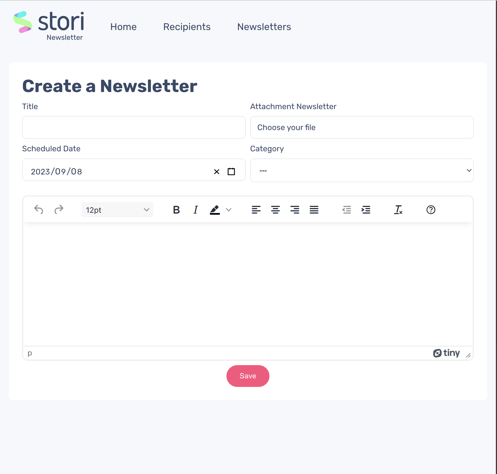

# Stori newsletter project


This project is a newsletter sending app, created using:
- In the frontend side:
    - React.js as the render library
    - Context for the state management
    - Sass as the CSS preprocessor 
- In the backend side:
    - Django as the framework
    - SQLite as the database
    - Redis as the broker for async task
    - Celery for run async task
    - Celery beat for running periodical task 

## Run the project
## Option 1 - Dockerize recommended:
### Prerequisites
- Docker 

### Setup
1. Setup your env variables:
    Create a `.env.` file in the `server` folder following the structure:
    ```
      EMAIL_HOST = 'smtp.gmail.com'
      EMAIL_USE_TLS = True
      EMAIL_PORT = 587
      EMAIL_HOST_USER = 'YOUR_EMAIL_HERE'
      EMAIL_HOST_PASSWORD = 'YOUR_APP_PASSWORD_HERE'
    ```

2. Run the docker images running the following command:
    ```sh 
    docker compose up 
    ```

3. Enjoy the project
Go to `http://localhost:3000/` and navigate through the options


## Option 2:
### Prerequisites
- Node version >= 16
- python version 3
- django

### Setup
1. Setup your env variables:
    Create a `.env.` file in the `web` folder following the structure:
    ```
      REACT_APP_API_URL=http://localhost:8000
      REACT_APP_TINY_MCE_API_KEY=API_KEY_HERE
    ```

    Create a `.env.` file in the `server` folder following the structure:
    ```
      EMAIL_HOST = 'smtp.gmail.com'
      EMAIL_USE_TLS = True
      EMAIL_PORT = 587
      EMAIL_HOST_USER = 'YOUR_EMAIL_HERE'
      EMAIL_HOST_PASSWORD = 'YOUR_APP_PASSWORD_HERE'
    ```

2. Run the BE project

    2.1 Install dependencies

    __Note:__ I suggest use virtual environments to avoid conflicts with the existent python setup

    ```sh
    pip install -r requirements/dev.txt
    ```

    2.2 Run Redis/celery/celery beat

    2.3 Create the database schema and table, run:

    ```sh
    python manage.py migrate
    ```

    2.4 Run the server:
    
    Go to the `server` folder and run the following command:
    ```sh
    python manage.py runserver 0:8000
    ```


3. Run the FE project

    Open the terminal in the `web` folder

    3.1 Install dependencies, running:

    ```sh
    yarn 
    ```

    3.1 Run the project:
    ```sh
    yarn start
    ```
